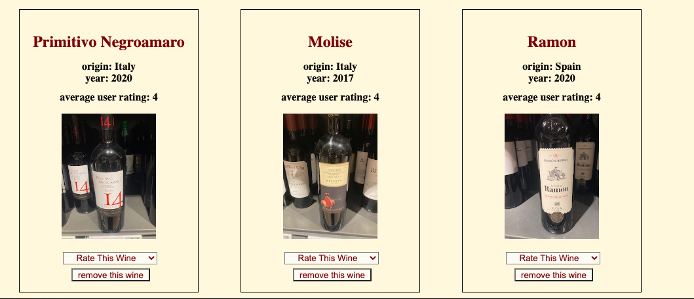
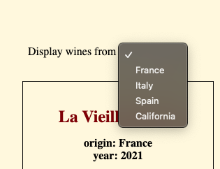
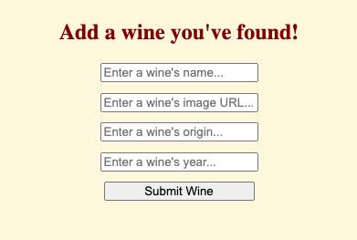

#Secret Somm

Secret Somm is a wine application where users can rate, or search wines from a database and also add ones they've found.
This app removes the pressure of choosing wines like having a sommelier standing next to you to assist you. 

Features

Each wine has a front and back photo for the user to analyze as though the bottle were in their hand! Simply scroll over each photo to view. Users can rate the wine for themselves and also see the average user rating for each wine.

There is a "search by region" feature that filters the wines on display by place of origin,

 as well as a "submit wine" form where users can submit wines that they've found that they don't already see featured on the application.

 

 With the document.DOMContentLoaded and the "search by region" filter the GET request to the server is being fulfilled. With the "rate this wine" feature the PATCH request to the serveris being fulfilled. Submit a new wine fulfills the POST request, and finally the "remove this wine"feature fulfills the DELETE request.

